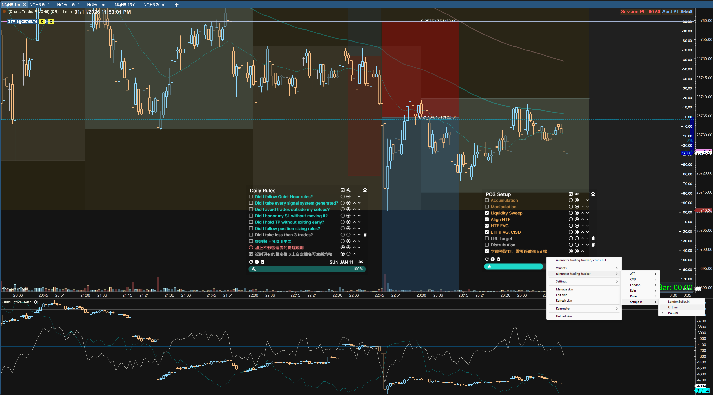
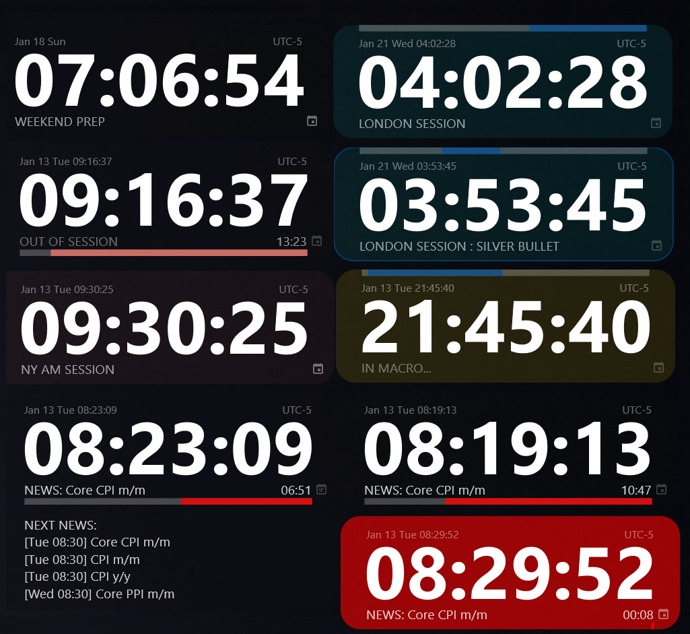
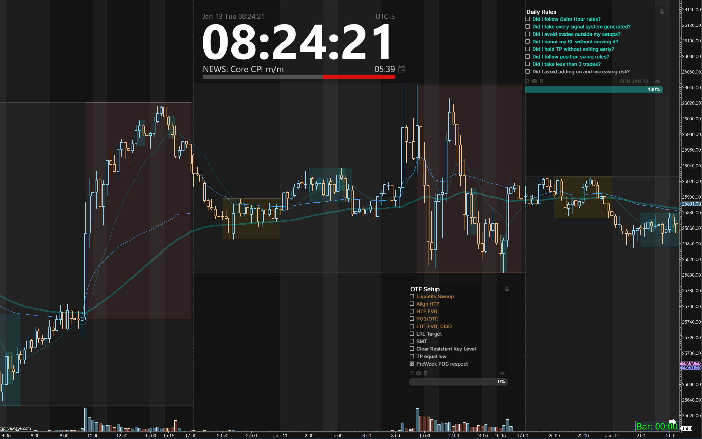

# ✔️ Rainmeter Trading Suite (Trading Clock & Task Tracker)

A professional Rainmeter widget suite designed for serious traders. This toolset combines a high-precision market timing engine with a rule-based task tracker to help maintain awareness and discipline during live trading and journaling.

這是一套為專業交易員打造的 Rainmeter 插件組合。結合了「高精度市場時鐘」與「規則化任務追蹤器」，旨在幫助交易員在截圖記錄與交易日誌中，保持紀律意識與時空同步。

## 🎞️ Preview / 預覽

<div align="center">
  
  <br>
  <p><i>Synchronized high-precision market clock and trading discipline tracker.</i></p>
  
  <table border="0">
    <tr>
      <td></td>
      <td></td>
    </tr>
    <tr>
      <td></td>
      <td></td>
    </tr>
    <tr>
      <td></td>
      <td></td>
    </tr>
  </table>
</div>

---

## 🕒 Module 1: Professional Trading Clock / 模組 1：專業交易時鐘
A timing engine specifically calibrated for New York markets with institutional session logic and economic data.
專為紐約市場校準的高精度時間引擎，整合了機構級的時段邏輯與經濟數據。

- **Auto DST / 自動夏令時**: Intelligent detection of UTC-4 / UTC-5. / 智能偵測 DST，無需手動調整。
- **2026 Calendar / 2026 市場日曆**: Built-in US holidays and early close (13:00) alerts. / 內建 2026 全年美股節日與提早收盤提醒。
- **Session Logic / 交易時段邏輯**: Real-time detection of **Asia, London, NY AM/PM, and Silver Bullet** sessions with contextual UI colors. / 即時識別各大時段，UI 顏色隨當前活躍時段自動切換。
- **Economic Calendar / 智能財經日曆**: Auto-fetches "High Impact USD" news from Forex Factory with countdowns and 10s flash warnings. / 自動抓取高影響力 USD 新聞，具備新聞倒數與 10 秒閃爍預警。
- **Simulation Mode / 穿越模擬模式**: "Time Travel" feature for backtesting behavior on any specific date. / 開發者可設定特定日期測試時段變換與 UI 行為。

---

## 📝 Module 2: Trading Task Tracker / 模組 2：交易規則追蹤器
Highly flexible criteria tracking optimized for monitoring setups and execution rules.
高度靈活的進場條件追蹤工具，透過權重計算，將你的交易紀律視覺化。

- **Flexible Structure / 完全自定義結構**: 
  - **Renameable Folders**: Rename `Setups-ICT` to anything (e.g., `SMC-Strategy`). / 可隨意更改資料夾名稱。
  - **Duplicate .ini**: Rename or duplicate `.ini` files to run multiple independent trackers. / 檔案可隨意改名或複制，同時開啟多個獨立策略追蹤器。
- **Weighted Progress / 權重進度條**: Visualize Major vs. Minor rules; Important tasks can hold 80% weight. / 區分主要與一般條件，主要條件可佔進度條 80%。
- **Screenshot Mode / 截圖模式**: Instantly hide edit icons for a clean look in your journal. / 一鍵隱藏編輯按鈕，呈現乾淨介面供截圖存檔。
- **Trash Bin / 垃圾桶系統**: Recover accidentally deleted rules. / 防止意外刪除重要的交易規則。

---

## 📜 Module 3: Multi-Source Notifier (Quotes & Notes) / 模組 3：多來源通知器
A dynamic content engine for displaying trading wisdom, psychological reminders, or multi-asset journals with a sleek, automated interface.
多功能動態內容引擎，用於顯示交易格言、心理提醒或多資產交易筆記，具備流暢的自動化界面。

- **Command-Driven Integration / 指令驅動整合**: 
  - **Instant Import**: Use `/import:` or `/replace:` commands to sync external `.csv` or `.txt` data. / 透過 `/import:` 或 `/replace:` 指令快速匯入外部數據。
  - **Auto-Converter**: Automatically transforms raw text/CSV into optimized JSON structures. / 自動將原始文字或 CSV 轉換為優化的 JSON 結構。
- **Smart Filter & Labels / 智慧過濾與標籤**: 
  - **Multi-Label View**: Filter messages by specific categories (e.g., Important, Completed) using a rule-based label system. / 透過標籤系統，即時過濾「重要」或「已完成」等特定類別。
  - **Validation Logic**: Intelligent fallback to "All" mode if a filter result is empty, ensuring zero UI deadlocks. / 若過濾無結果，系統會自動切回全選模式並跳出通知，防止介面卡死。
- **Multi-Source Logic / 多來源切換**: 
  - **Independent Progress**: Support for up to 5 independent data sources, each remembering its own last-read position. / 支援最多 5 個獨立資料來源，且各自記錄上次閱讀的索引進度。
  - **Quote Mode**: Dedicated support for author metadata with a dimmed, synchronized fade-in/out effect. / 專為格言模式設計的作者欄位，具備低亮度、同步淡入淡出的視覺效果。
- **Automated Pacing / 自動化節奏**: 
  - **Cycle Timer**: Adjustable auto-rotation intervals (5s / 10s / 30s) with instant-apply logic. / 可自定義自動輪播間隔，且更換設定後立即重置計時器，無需等待。
  - **Notification Layer**: Built-in UI alerts for system states like "File Not Found" or "Trash is Empty." / 內建系統通知層，即時顯示文件遺失或垃圾桶狀態等反饋。

---

## 🛠️ Configuration Guide / 設定指南

### 1. Market Clock Settings (`MarketClock.ini`)
| Variable / 變數 | Description / 說明 |
| :--- | :--- |
| `Scale` | Overall UI size (e.g., `3.4` for 4K screens). / 整體縮放比例（如 4K 螢幕建議設定 3.4 以上）。 |
| `SHOW_NEWS` | Expand or collapse the news panel (`0`/`1`). / 開啟或關閉下方的新聞面板。 |

### 2. Task Tracker Settings (`Rules.ini` / `Setup.ini`)
| Category / 類別 | Variable / 變數 | Description / 說明 |
| :--- | :--- | :--- |
| **Layout / 佈局** | `FONT_SIZE` | Base font size; all icons and bars scale accordingly. / 基礎字體大小，Icon 與進度條會自動縮放。 |
| | `SkinWidth` | Window width (recommended min: 350). / 視窗寬度，推薦不要小於 350。 |
| **Logic / 邏輯** | `MAX_MAJOR_DONE_RATE` | Progress bar weight for "Important" tasks (Default: 80). / 主要條件被勾選後佔進度條的比例。 |
| | `SHOW_IMPORTANT` | Toggle Major (Star) rule buttons. / 是否啟用主要條件（星號）功能。 |
| **Color / 顏色** | `ColorMajorDone` | Progress bar color for completed major rules. / 主要條件達成時的進度條顏色。 |
| | `SolidColor` | Background color and transparency (R,G,B,Alpha). / 背景色與透明度。 |

---

# 🖋️ Customize & Trading Tracker Variables Guide (User Settings)

You can fully customize your Trading Tracker by editing the `[Variables]` section within the `.ini` file. Below is a detailed breakdown of each setting:

## 1. General Appearance & Features
Controls the basic layout and visibility of UI elements.

| Variable | Description | Recommended / Example |
| :--- | :--- | :--- |
| `TITLE` | The title displayed at the top of the widget. | `TITLE=Daily Trading Rules` |
| `SolidColor` | Background color and transparency (R,G,B,Alpha). | `0,0,0,150` (Dark Semi-transparent) |
| `SkinWidth` | The overall width of the widget. | `350` (Recommended minimum) |
| `SHOW_REMIND` | Toggle "Reminder" icons (Does not affect progress). | `0` (Off), `1` (On) |
| `SHOW_IMPORTANT`| Toggle "Major" icons (Affects 80% of progress). | `0` (Off), `1` (On) |
| `SHOW_DATE` | Show/Hide the date at the bottom. | `0` (Off), `1` (On) |
| `SHOW_TIME` | Show/Hide the time (Static, updates on refresh). | `0` (Off), `1` (On) |

## 2. Typography & Dynamic Scaling
This widget uses **Dynamic Proportional Scaling**. You only need to adjust `FONT_SIZE`, and other dimensions will scale automatically to maintain alignment.

| Variable | Description | Default Formula / Ref |
| :--- | :--- | :--- |
| `FONT_FACE` | The name of the font to be used. | `Inter`, `Arial`, `Roboto` |
| `FONT_SIZE` | Base font size for all text. | `12` (Default), `15` (Large) |
| `LINE_HEIGHT` | Vertical spacing between task lines. | `(#FONT_SIZE# * 2.1)` |
| `BUTTON_SIZE` | Size of all action icons (Add, Refresh, etc.). | `(#FONT_SIZE# + 2)` |
| `BAR_HEIGHT` | Thickness of the progress bar at the bottom. | `(#FONT_SIZE# * 2)` |

## 3. Color Configuration
Colors use the format `Red, Green, Blue, Alpha` (Range: 0-255).

### 🔹 Task Text Colors
| Task Type | Active (Pending) Color | Ticked (Completed) Color |
| :--- | :--- | :--- |
| **Normal Rules** | `ACTIVE_TASK_COLOR` | `DONE_TASK_COLOR` |
| **Major Rules** | `IMPORTANT_TASK_COLOR` | `DONE_IMPORTANT_TASK_COLOR` |

### 🔹 Progress Bar Colors
* **ColorTodo**: Background color of the bar (Incomplete portion).
* **ColorDone**: Fill color for completed normal rules.
* **ColorMajorDone**: Fill color for completed major rules (Usually a high-contrast color).

## 4. Advanced Logic
| Variable | Description | Default Value |
| :--- | :--- | :--- |
| `MAX_MAJOR_DONE_RATE` | Max percentage weight for rules marked as "Major". | `80` (Major rules take 80%) |
| `TRASH_LIMIT` | Maximum number of deleted items kept in the trash. | `10` |

---

## 📦 Installation / 安裝步驟
1. Install [Rainmeter](https://www.rainmeter.net/) if you don’t have it already.
2. Load this skin in Rainmeter.
3. Customize your trading setups and daily rules to track your trades.
4. Use it while taking screenshots to document your trading journey.

###### Via Installer

+ Go to the [Releases](https://github.com/beer/rainmeter-trading-tracker/releases) page and download the latest .rmskin file.
+ Install skin with a double click to the downloaded file.
+ [Activate the skin](#activate-skin)

###### Via Source Code

- Download this source code and place the entire `rainmeter-trading-tracker` folder in the location of your Rainmeter skin. Generally it is look like `C:\Users\<USERNAME>\Documents\Rainmeter\Skins\`
- [Activate the skin](#activate-skin)

##### Activate Skin

- Activate `rainmeter-trading-tracker` skin
  - You can do this by right-clicking on an already active skin to bring up the Rainmeter menu
  - Navigate to `Rainmeter > Skins > rainmeter-trading-tracker > Setups/Rules > Large/Medium/Small.ini`
    - If you do not see `rainmeter-trading-tracker` in the skin selection, try navigating to `Rainmeter > Refresh all`

---

## 🤖 Advanced Simulation (Developer Only) / 進階模擬測試
To test future dates, edit the top of `MarketClock.lua`:
若要測試未來日期，請修改 `MarketClock.lua` 頂部：
```lua
DEBUG_MODE = true
DEBUG_NY_TIME_STR = "2026-01-14 09:30:00" -- Jump to NY Open / 模擬紐約開盤